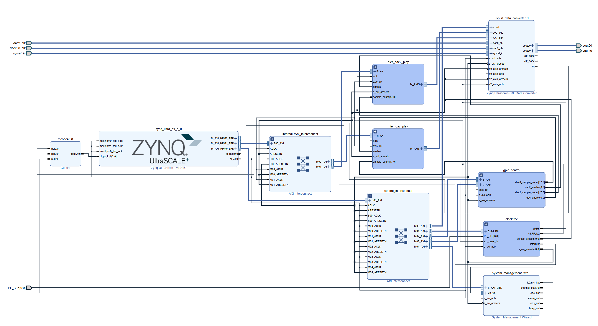

# RFSoC4x2 Based AWG

A simple 9.8304 GSPS AWG implementation using the RFSoC 4x2 development board and the PYNQ framework.

## Overview

- **Waveform generation**: 9.8304 GSPS DAC output with 14-bit resolution
- **User-friendly interfaces**: Jupyter notebooks with example code
- **Web application**: React frontend with FastAPI backend

## Documentation

**[Documentation](https://rfsoc4x2-awg-docs.readthedocs.io/en/latest/)**

## Quick Start

Follow the [installation guide](https://rfsoc4x2-awg-docs.readthedocs.io/en/latest/installation/) to get started.

To install the firmware helpers into the active Python environment and deliver the example notebooks through PYNQ, run:

```bash
scripts/install.sh
```

Installed notebooks can import the overlay controller and signal helpers directly:

```python
from firmware import OverlayController
from firmware.signals import sine, sawtooth
```

## Web Application Deployment

The web application is deployed directly on the RFSoC board. The backend runs as a native systemd service in the PYNQ environment, and nginx serves the built frontend from `/var/www/rfsoc-awg` while proxying `/api/` to the backend.

Build the frontend before copying it to the board:

```bash
cd frontend
npm install
npm run build
```

Copy the repository and `frontend/dist` to the RFSoC board at `/home/xilinx/RFSoC4x2-AWG`, then install the services on the board:

```bash
sudo scripts/install_backend_service.sh
sudo scripts/install_frontend_nginx.sh
sudo scripts/deploy_frontend.sh
```

Check the deployment:

```bash
sudo systemctl status rfsoc-backend
curl http://127.0.0.1:8001/status
curl http://127.0.0.1:8080/api/status
```

Open the frontend at `http://<rfsoc-board-ip>:8080/`.

## Repository Structure

```
RFSoC4x2-AWG/
├── backend/               # FastAPI backend and waveform
├── hdl/                   # Hardware description language files
├── notebooks/             # Jupyter notebooks with example code
├── frontend/              # React frontend
├── firmware/              # Firmware-facing hardware helper modules
├── overlays/              # FPGA bitstreams and hardware handoffs
├── deploy/                # systemd and nginx deployment files
├── scripts/               # Utility and deployment scripts
└── tests/                 # Test files
```

## FPGA Build

The FPGA build process is automated using Vivado TCL scripts located in the `scripts/` folder:



## Contributing

If you find bugs or have any other ideas in mind what to add, please feel free to open a pull request.

## License

MIT
