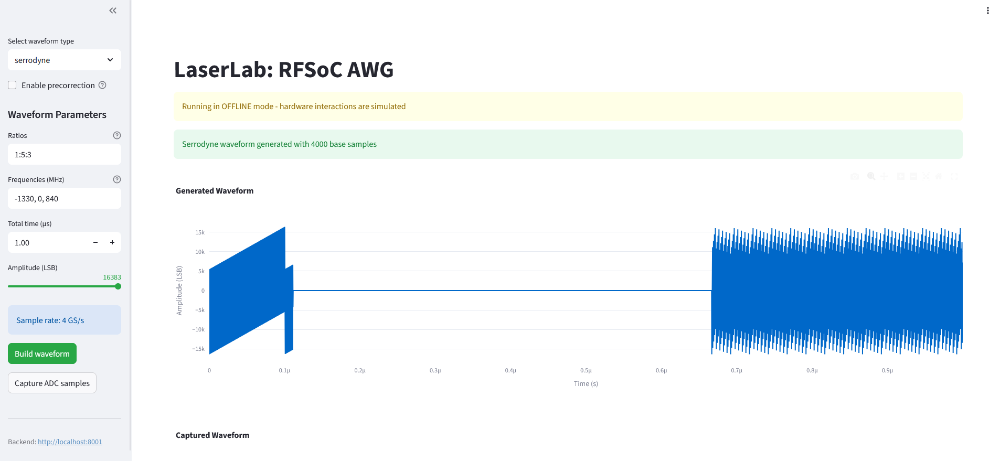

# Streamlit Frontend

The Streamlit frontend provides a web-based graphical user interface for researchers to interact with the RFSoC AWG system.

## Overview

## Architecture

### Waveform Controls
