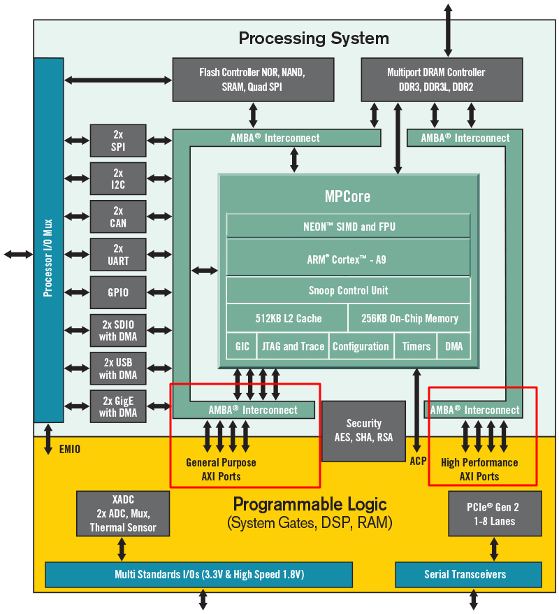

# RFSoC-Based Arbitrary Waveform Generator

This project implements an AWG on the Xilinx RFSoC 4x2 development board. It can be used for high-frequency serrodyne modulation applications.

## Core Capabilities

- **High Sampling Rates**: 4.0 GSPS output via 14-bit DACs and up to 8.0 GSPS (not tested yet)
- **Complex Waveforms**: Concatenation of multiple sawtooth ramps with independent frequency and phase control.
- **User-Friendly Interface**: Control via Streamlit or API calls (FastAPI).

## Architecture Overview

The system utilizes a hybrid approach where the ARM Processing System (PS) handles waveform synthesis and management, while the Programmable Logic (PL) ensures high-speed, deterministic data streaming to the RF Data Converters.



## Hardware Specifications

| Feature           | Specification                      | Utility                                  |
| ----------------- | ---------------------------------- | ---------------------------------------- |
| DAC Resolution    | 14-bit                             | High dynamic range for waveform fidelity |
| Max Sampling Rate | 4.0 GSPS (8.0 GSPS not tested yet) | Support for GHz-scale modulation         |
| ADC Sampling Rate | 4.0 GSPS                           | High-bandwidth loopback calibration      |
| Memory Type       | DDR4 & BRAM                        | Flexible storage for complex sequences   |

## Quick Start

1. [Install the software](installation.md)
2. [Configure networking](networking.md)
3. [Set up remote access](tailscale.md)
4. [Deploy services](systemd.md)

## Project Structure

```
RFSoC4x2-AWG/
├── app/                   # Main application code
│   ├── app.py             # Application entry point
│   ├── backend.py         # FastAPI backend
│   ├── frontend.py        # Streamlit frontend
│   ├── signal_generator.py # Waveform synthesis
│   └── overlay_control.py # FPGA overlay management
├── overlays/              # FPGA bitstreams
├── notebooks/             # Jupyter notebooks from experiments
├── scripts/               # Utility scripts
└── docs/                  # Documentation
```
