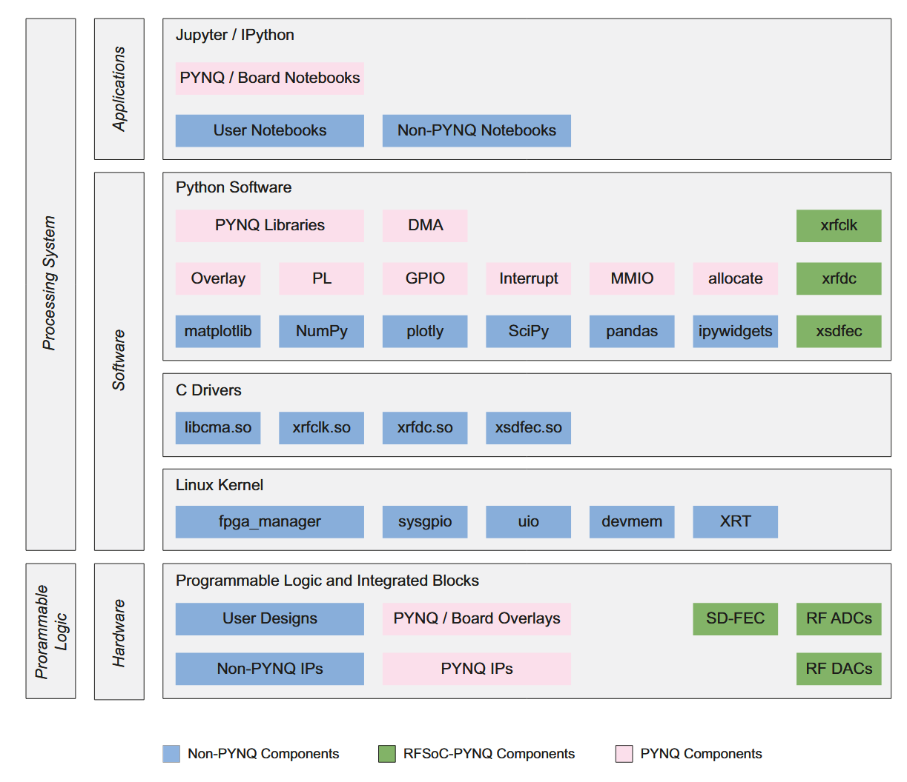

# Jupyter Notebook Environment

The PYNQ environment provides a built-in Jupyter Notebook server for a fast and more interactive development.



## Accessing Jupyter

Navigate to:

```
http://<rfsoc-awg>:8888
```

Default password: `xilinx`

## Example

### PYNQ Overlay Class

Load a hardware design:

```python
from pynq import Overlay

# Load the AWG overlay
ol = Overlay('/home/xilinx/RFSoC4x2-AWG/overlays/awg_manbhattarai.bit')

```
